# Miami's Post Economy Recovery

Alex Link

## Abstract

The United States has witnessed the highest number of cases and deaths
during the COVID-19 pandemic. Florida State has seen over 2.75million
cases with over 40,000 deaths, causing economic shutdowns and country
lockdowns. A solution to help the economy recover and help the Miami
citizens get back on their feet lies in a Decision Support Tool that
would offer real time strategies to leaders recovering from the COVID-19
effects. In partnership with US Ignite, data was mapped and modeled
using a Bayesian Hierarchical regression, PanelOLS regression and a
Dirichlet regression model. These models were utilized to understand, a)
how industry employment distribution and educational attainment affect
median income, b) the main drivers of potential economic growth, and, c)
how the composition of industry employment was affected by the pandemic.
The Bayesian Hierarchical regression model indicated that the industry
that could have the biggest effect on increasing median income, across
all subdivisions, is public administration, followed closely by the
wholesale trade industry. Additionally, increasing the education level
in certain subdivisions increases the median income more than it does in
other subdivisions (Rural versus Urban Areas). Our business growth model
(PanelOLS regression) was able to explain over a quarter of the variance
in predicting business growth that the predictor variables explain
collectively, by attaining a $R^2$ of 25.85%. An ARIMA model was
implemented to forecast the total Nonfarm employment for 3 months. With
an RMSE of 0.0016168 on the validation set, results from our Dirichlet
model were applied to the total Nonfarm forecast to predict the
employment forecast for individual industries. This will be able to
provide Miami leaders a deeper look into the future composition of their
labor market, providing predictive models that could be implemented for
scenario analysis.

## Introduction

The COVID-19 pandemic sent shockwaves across the world causing economic
shutdowns and country lockdowns. The infectious disease caused by the
newly discovered coronavirus has led to hundreds of thousands of deaths,
and still counting. As the health and human toll grows, the economic
damage encountered thus far is evident with the world experiencing the
largest economic shock in decades. Economic prospect reports envision
contractions in the global GDP with a loss of human capital through lost
work, schooling, and fragmentation of supply linkages.

The United States has witnessed the highest number of cases and deaths
during this pandemic. Shifting our focus to Florida, the state has seen
almost 2.75million cases with approximately 40,000 deaths thus far.
Schools have been suspended, small businesses have suffered and have had
to shut down, the economy is at a standstill. "The best-case scenario
doesn\'t look that good," several business owners state. A team of Data
Scientists from the University of Virginia were approached to tackle the
economic issue currently faced by the city of Miami due to the pandemic.
The goal is to model map data from Federal agencies, city departments,
smart city sensors, residents' reviews and other datasets to advance the
City's economic recovery efforts. These models will be aimed to offer a
real-time understanding of Miami's economy, responding to both the
current environment and providing a long-term solution as the city moves
into its post-pandemic recovery. The following research questions were
tackled to help build these models:

1.  How do industry employment distribution and educational attainment
    affect the median income of individual census tracts within
    different subdivisions of Miami-Dade County? Which of these
    industries perform particularly well and lead to a higher median
    income, as well as the importance of a bachelor's degree in
    determining income for each subdivision?

2.  What are the main drivers of potential economic growth opportunities
    in Miami-Dade County? Which of these drivers are influential to
    business growth and increasing employment opportunities within the
    County?

3.  How has the composition of industry employment (i.e. the proportion
    of employment within the ten primary industry classifications) been
    affected by the COVID-19 pandemic and what is its outlook moving
    forward?

## Literature Review/Background

I.  Miami, Florida Economic Effect

With over 2.7 small businesses contributing to Florida's overall GDP,
small businesses are the backbone of the state's economy. The COVID-19
pandemic has had serious implications on the Florida economy. A report
by the Miami Chamber of Commerce stated that 60% of new job gains in
Florida have come from small businesses. Businesses in the tourism,
leisure and hospitality industry were hit hardest as the lockdown
suspended travel. Businesses were forced to close their doors, with some
voluntarily closing. Approximately 85% of businesses had lost revenue
according to the report with a majority of them seeking state and
federal funding to stay in business. The report examined the impact of
the pandemic on these businesses statewide through a COVID impact survey
conducted by the Florida Small Business Development Center Network, the
Florida Chamber Foundation and the University of West Florida Haas
Center. The survey was distributed to 100,000 small businesses with the
following findings reported:

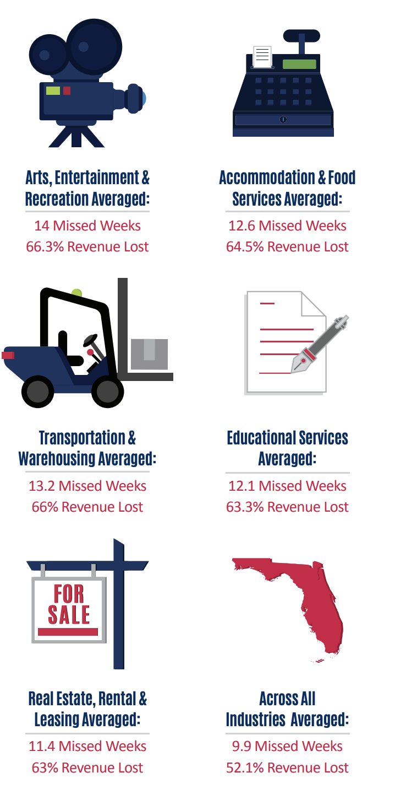
<p>
a)  29% of businesses benefit from an online platform. Around 53% of
    businesses leased facilities to run their businesses, with 33%
    owning them. Renting/leasing facilities is a cost to the business
    especially when no revenue is earned, or businesses are shut. Being
    able to run a business through an online channel or platform
    appeared to be beneficial as it enabled businesses to continue
    running their businesses and earn revenue.<br>


b)  Since the outbreak of the pandemic, various events and activities
    were restricted across the State. Majority of the businesses that
    were forced to close during the crisis with those that relied on in
    person operations experienced longer periods of closure. Those that
    transitioned into remote operations experienced less. Revenues
    dropped from 2019 to 2020. The top five most impacted industries as
    shown in the figure included: Arts, Entertainment and Recreation,
    Transportation & Warehousing, Educational Services, Real Estate,
    Rental & Leasing, and Accommodation & Food Services. The
    transportation industry suffered significantly even after businesses
    opened up due to travel restrictions.<br>


c)  With supply chains being halted, there was a lack of access to
    supplies and thus businesses were forced to change their business
    model. Employee layoffs, transitioning remote, permanent closures
    were all experienced. Employment impacts were severe with 13% laid
    off, and 5% displaced. The Florida Chamber of Commerce stated that,
    "COVID-19 affected many small businesses around the state in various
    ways. 85.1% of business owners experienced a loss of revenue during
    the pandemic. To mitigate the risks of COVID-19, 59.4 percent of
    businesses reported adding expenses for public safety. Nearly 54
    percent reported experiencing event cancellations. While those
    businesses experienced disruptions in demand, 39.6 percent struggled
    with disruptions in their supply chain. The unforeseen presence of
    these issues led business owners to adjust either their business
    model (46.5 percent) or business hours (41.2 percent). Some even
    established a new alternative delivery method (30 percent), while
    another 20 percent enhanced an existing second mode of delivery.
    Unfortunately, about 40 percent of respondents reported closing
    their business as a result of COVID-19. Loss of revenue was a
    contributing factor as well (MCC, 2020)".
    <br clear="right"/></p>
    
<p align="center">
   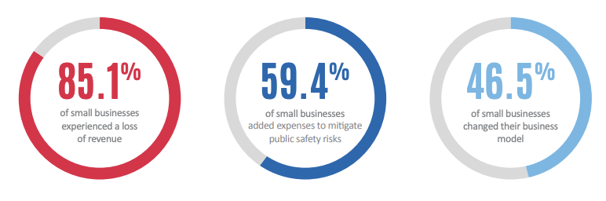
</p>

II. Business Growth Forecasting

A research paper by the Harvard Business School explored how Yelp data
could be used to forecast economic activity. Data collected from Yelp
was able to complement government surveys by measuring economic activity
at a granular level in real time across geographic scales. National
statistics from the Bureau of Labor Statistics are reported in a timely
manner but are published after long lags (usually 2 years) and thus are
not always up to date. Yelp is an online platform that has been able to
provide data at a granular level to supplement national statistics,
measuring outcomes that were not included in national datasets. In the
paper we explored, crowdsourced data from Yelp was used to measure the
local economy and determine whether online data can forecast government
statistics.

The ability of Yelp to predict changes in the number of active
businesses was tested and measured by the County Business Patterns. The
results found that the changes in the number of businesses reviewed on
Yelp can be used to predict changes in the number of establishments with
prediction power increasing with wealth and education level. The study
had used all the data from Yelp containing business establishments and
reviews which were merged with CBP data. Comparing the two in 2015, we
saw that the CBP had 542,029 restaurants listed across 24,790 zip codes
with Yelp listing 576,233 restaurants across 22,719 zip codes. Being
able to list more businesses helped with its predictive power which was
further analyzed using zip-code level economies and establishments
across various industries.

The study used a random forest algorithm to predict growth in CBP
establishments. Change in CBP establishments was measured using two lag
changes together with fixed effects for zip code and year. The results
showed that lagged Yelp data can generate an algorithm that is able to
explain 21.4 percent of the variance of residual quantity using an
out-of-bag estimate in the training sample, which represents 75 percent
of the data. In a testing sample not used to generate the algorithm, the
prediction was able to explain 29.2 percent of the variance of this
residual quantity. At a restaurant level, Yelp prediction is able to
explain 21.2 percent of variance out of the training sample, using an
out-of-bag estimate. The augmented Yelp prediction can explain 26.4
percent of the variance in the testing sample" (E. L. Glaeser,et.al,
2017). With all this data, the paper further analyzes where the
predictive power of the Yelp data lies. Firstly, it has more power in
denser, wealthier and more educated areas. In terms of industries, it is
more predictive in the retail, leisure, and hospitality industries. This
laid the foundation for us to explore data from the US Census Bureau and
Bureau of Labor Statistics, focusing on Miami-Dade County in Florida.
Being able to explain 26.4 percent of the economic growth is a decent
baseline to build our models around.

<ins>Fixed Effects</ins>

These are variables that are constant across the object of study. For
example: individuals, communities, and in the Yelp study, businesses.
These variables do not change (examples include features like gender or
sex) or change at a constant rate over time (age). In the study explored
above, zip code and year were the fixed effects variables used
(​​Statisticshowto, 2021).

## Methods

### Data Description

I.  Data Sources:

A.  <ins>American Community Survey-US Census Bureau:</ins>

> Zip code level data providing 5-year annual estimates. The data
> provided by the ACS contains social, economic, housing, and
> demographic information of any geographic location of interest at the
> zip code level. For our business growth rate model, our data initially
> consisted of 83 variables across all 80 zip codes that comprise
> Miami-Dade County. Unfortunately, the ACS has only published data up
> to 2019, and did not release its estimates for the 2020 survey due to
> the impacts of the COVID-19 pandemic on the data collection process.
> However, our data does begin in 2011, while the country was still
> recovering from the economic effects of the Great Recession, so these
> effects would be captured by our model and hopefully serve as a proxy
> for the economic recovery of Miami post pandemic. After some initial
> exploratory data analysis, our 83 features were narrowed down to 13
> that included number of business establishments, labor force, income
> to poverty level, household income, median household income, aggregate
> household income, average household income, the GINI index (income
> inequality measure) for the zip code, median property value, the
> portion of the workforce not employed in the information, finance or
> professional business services industries, income per capita,
> population density and the portion of the adult age population with
> less than a college education. Three outlier zip codes were also
> removed from the dataset as their demographic make-up was found to be
> significantly different from the others. Zip code 33122 only contains
> Miami International Airport, 33039 only contains Homestead Air Force
> Base, and 33101 was a small block only containing a government office,
> a school and a large public parking garage.
>
> For our Bayesian Hierarchical Model, our data consisted of 15
> variables at the census tract level. 13 of these variables represented
> the percentage employment for each industry within each census tract,
> while the remaining 2 represented the median household income and the
> percent of individuals within the tract that held a bachelor's degree
> or higher. After examining the data of all 519 census tracts within
> Miami-Dade county, 14 were found to contain missing values and were
> removed from the data set. Each census tract was then coded to one of
> the 12 subdivisions in which it was located to format it properly for
> our hierarchical model.

B.  <ins>Bureau of Labor Statistics</ins>

> The Bureau of Labor Statistics (BLS) provided monthly employment
> figures for Miami-Dade County. As this data is provided at a county
> level and is not as granular as the data provided by the American
> Community Survey, we were able to obtain monthly employment numbers
> going as far back as January of 2003, to as recently as October of
> this year (2021). These employment figures included total nonfarm
> employment, as well as employment numbers for the ten primary
> industries that comprise nonfarm, which include total government jobs,
> the mining, logging & construction industry, the manufacturing
> industry, education & health services, the leisure & hospitality
> industry, the financial industry, professional business services, the
> trade, transportation & utilities industry, the information industry &
> other, for those jobs which do not fall into the aforementioned,
> traditional nine industry classifications.

II. Data Flow Diagram and the Data Life Cycle

Below is a data flow diagram highlighting the key steps in our data life
cycle. Data was collected from the US Census Bureau and the Bureau of
Labor and Statistics. The software used for the data analysis were
Python and R. The data was obtained and pulled in using an API. EDA was
carried out to understand relationships between the variables used and
which ones we would need to build our models to address the research
questions of this study. After all the data cleaning, pre-processing and
EDA was complete the economic variables of interest were used to build
and develop the models. With the help of our sponsor, these models were
pushed and stored in a Carto Database which was then reflected on the
company\'s (US Ignite) real time visual dashboard.

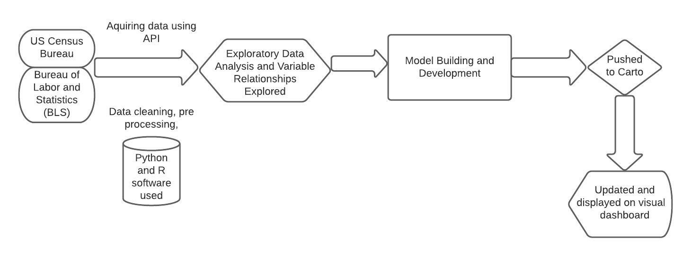

### Exploratory Data Analysis (EDA): 

EDA was conducted to explore relationships between the variables of
interest in our data. We wanted to see the relationships between the
number of business establishments in a zip code with various subsets of
economic and demographic data. We settled on looking at subsets of labor
data, such as the labor force and the portion not employed in the
information, finance or professional business services industries, as
well as various economic indicators. Seaborn pair plots and correlation
matrices were used to visualize these relationships, as can be seen
below:
<ins>Seaborn Pair Plot:</ins>

<p align="center">
   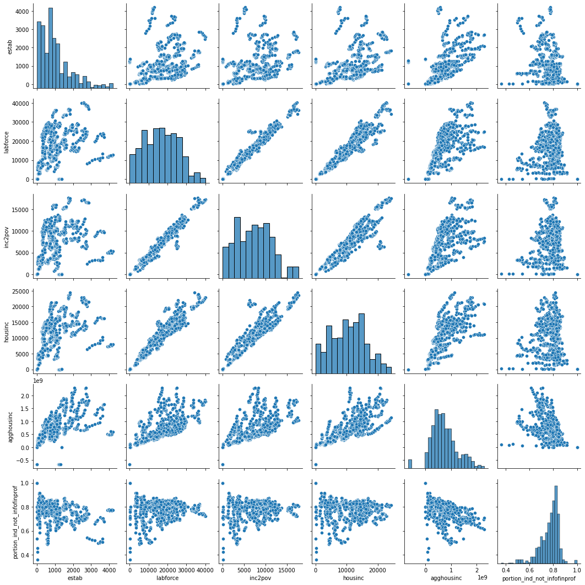
</p>

Figure 1: The plots above show the relationship between the variables as
they increase or decrease. For instance, as the labor force increases,
household income increases as well. We are also able to see which of the
variables influence the total number of business establishments. This
gives us an idea on which variables drive the county's overall economy.

<ins>Correlation Matrix:</ins>

<p align="center">
   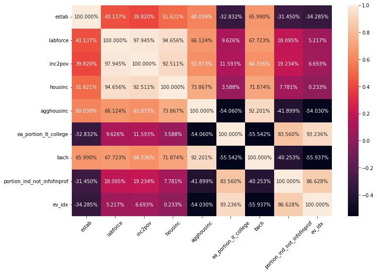
</p>

Figure 2: Figure showing a correlation between the variables of
interest. The darker the cell the lower (or more negative) the
correlation between the variables; the lighter the cell the higher (more
positive) the correlation. Some noteworthy correlations of significance
are number of establishments and education (positive relationship
between areas with a high portion of bachelor's degree holders and
negative relationship where the adult population has less than a college
education), and higher income positively associated with more education.
These help lay the foundation in answering the research questions of
interest. Through performing EDA, we are able to get a better idea of
which variables will have more of an effect on the number of
establishments in an area, which allows us to narrow down our analysis
to a subset of predictors from our original 83 to further experiment
with in our models.

### Methodology:

We explored a variety of different techniques in answering our research
questions. First, we built a Bayesian hierarchical regression model to
see how industry employment distribution and educational attainment
within individual census tracts affect the median income of the
different subdivisions of Miami-Dade County, and which industries could
potentially yield a higher median income value. The importance of a
bachelor\'s degree was also explored through this model, estimating its
effect on median household income. A PanelOLS model (implemented in
Python) with fixed entity (zip code) and time effects was built to
predict annual business growth rates for each zip code with the use of
lagged variables, similar to the Yelp data study we explored. Finally, a
Dirichlet regression model (implemented in R) was used to predict
industry employment numbers in Miami-Dade county. This model was then
combined with an ARIMA model, which was used to forecast monthly total
nonfarm employment, to produce three month predictions of individual
industry employment figures. These models are further explained below:

#### <ins>Bayesian Approach: Hierarchical Modeling of Subdivision Income</ins>

A hierarchical regression model was built in order to explore and
analyze the effect of industry employment distribution and educational
attainment on median household income. This is a type of linear
regression where the observations in the dataset fall in a nested level,
commonly known as a hierarchy. They could be thought of as a multilevel
model, which allows for effects of predictors to vary across various
subdivisions. The model takes the following form (with the usual beta
coefficients having been replaced with letters here; i.e. 𝛽~0~ = 𝑎, 𝛽~1~
= 𝑏 and so forth):

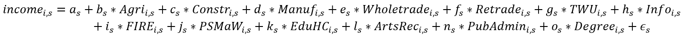

Where the above is representative of:

-   *income* - the median log income level of an individual census
    tract. A log transformation was applied to ensure a normal
    distribution, as the raw median income distribution across tracts
    was extremely positively skewed

-   *a~s~* - the subdivision level intercept (i.e. the median income
    level of the tract all else null)

-   *b~s~* - the subdivision level effect of an increase of jobs in the
    Agriculture, forestry, fishing and hunting, and mining industry on
    median income

-   *c~s~* - the subdivision level effect of an increase of jobs in the
    Construction industry on median income

-   *d~s~* - the subdivision level effect of an increase of jobs in the
    Manufacturing industry on median income

-   *e~s~* - the subdivision level effect of an increase of jobs in the
    Wholesale trade industry on median income

-   *f~s~* - the subdivision level effect of an increase of jobs in the
    Retail trade industry on median income

-   *g~s~* - the subdivision level effect of an increase of jobs in the
    Transportation and warehousing, and utilities industry on median
    income

-   *h~s~* - the subdivision level effect of an increase of jobs in the
    Information industry on median income

-   *i~s~* - the subdivision level effect of an increase of jobs in the
    Finance and insurance, and real estate and rental and leasing
    industry on median income

-   *j~s~* - the subdivision level effect of an increase of jobs in the
    Professional, scientific, and management, and administrative and
    waste management services industry on median income

-   *k~s~* - the subdivision level effect of an increase of jobs in the
    Educational services, and health care and social assistance industry
    on median income

-   *l~s~* - the subdivision level effect of an increase of jobs in the
    Arts, entertainment, and recreation, and accommodation and food
    services industry on median income

-   *n~s~* - the subdivision level effect of an increase of jobs in the
    Public administration industry on median income

-   *o~s~* - the subdivision level effect of an increase in percentage
    of residents holding a Bachelor's degree or higher on median income

-   *ϵ~s~* - the subdivision level error term

This linear relationship allows us to see the different effects certain
industries have on median income across different subdivisions of
Miami-Dade county; that is to say, are certain industries more important
in terms of increasing median income level in certain subdivisions than
others? This model also allows us to see the importance of educational
attainment per subdivision by seeing the effect percentage of residents
holding at least a bachelor's degree has on median income.

#### <ins>PanelOLS: Modeling Annual Business Growth Rates</ins>

In addressing our second research question, we looked at the work done
by our predecessors at the University of Chicago to see any economic
trends they may have identified in Miami-Dade County. One of their
models that stood out to us was their economic vulnerability index,
which showed quite a bit of dispersion in terms of the economic
prospects of the zip codes within the region. Seeing this dispersion
made it evident to us that although these zip codes are in the same
county, there were still significant differences in their economic
composition. To model the factors affecting business growth within
Miami-Dade County, while still capturing the differences within each zip
code, we decided to utilize a PanelOLS regression model with fixed
entity and time effects. "Panel data is a two-dimensional concept, where
the same entities are observed repeatedly over different periods in time
(TowardsDataScience,2021)". When one looks at the data collected from
the American Community Survey, one can see how a panel regression is
applicable to the dataset. The data is seen as a combination of cross
sectional and time series data. Cross sectional data is seen as
observations of multiple entities, in our case zip codes, and their
associated variables at a specific point in time. Time series observes
variables over multiple different time frames. When you combine the two,
you get a dataset that has multiple observations from different entities
over time. In our case, our dataset has annual observations for multiple
variables over the past decade for each zip code within Miami-Dade
County.

Conducting additional research into the field of economic data modeling,
specifically known as econometrics, we came across a paper by C.W.J.
Granger and P. Newbold on the subject of *spurious regression*, a
frequent phenomenon seen when attempting to model economic data.
Essentially, what this paper describes is the fact that when modeling
many economic relationships, the resulting $R^2$ will be high not due
to any true relationship between the variables, but simply due to the
fact that the dependent variable and independent variables continuously
grow over time. These underlying growth trends are highly correlated,
leading to autocorrelation within the model, resulting in a high $R^2$
without any truly significant economic meaning.

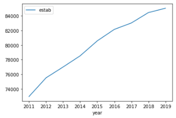 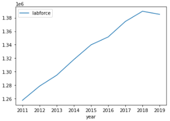 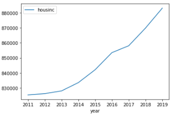

Looking at the above graphs made it evident to us that spurious
regression would be an issue for us if we attempted to model the raw
data as is. To address this phenomenon, we "detrended" our variables by
converting them into annual growth rates. These growth rate variables
were then lagged by one year to test their predictive capabilities on
estimating the following year's annual business establishment growth
rate. Various subsets of lagged indicators were fit against the
following year's business establishment growth rate and their results
were examined to verify that first: each individual predictor was
statistically significant (as indicated by their p-values); and second:
the model as a whole was statistically significant (as indicated by each
model's F-statistic). Those models that were determined to be
statistically significant were then compared to see which held the most
explanatory power, as represented by their coefficient of determination
($R^2$). Our best model, subject to the aforementioned criteria, had
the following structure:

```math
{estab}_{it} = \beta_{0} + \beta_{1}{estab}_{i,\ t - 1} + \beta_{2}{labforce}_{i,\ t - 1} + \beta_{3}{portion₋not₋infofinprof}_{i,\ t - 1} + \gamma U_{i} + \delta F_{t} + e_{it}
```
Where the above is representative of:

-   ${estab}_{it}$ - the current year's business establishment growth
    rate for zip code *i*

-   $\beta_{0}$ - a constant, baseline value

-   $\beta_{1}{estab}_{i,\ t - 1}$-the effect of the prior year's
    business establishment growth rate of zip code *i*

-   $\beta_{2}{labforce}_{i,\ t - 1}$-the effect of the prior year's
    labor force growth rate of zip code *i*

-   $\beta_{3}{portion₋not₋infofinprof}_{i,\ t - 1}$- the effect of the
    prior year's portion of the workforce not employed in the
    information, finance or professional business services industries
    growth rate of zip code *i*

-   $\gamma U_{i}$ - the unobserved fixed entity effects for zip code
    *i*

-   $\delta F_{t}$ - the unobserved fixed time effects for year *t*

-   $e_{it}$ - the error term

#### <ins>Dirichlet Regression: Modeling Industry Employment</ins>

In addressing our final research question, we took a look at the
employment figures for the ten primary industries that make up total
nonfarm employment in Miami-Dade County. As previously mentioned, these
include total government jobs, the mining, logging & construction
industry, the manufacturing industry, education & health services, the
leisure & hospitality industry, the financial industry, professional
business services, the trade, transportation & utilities industry, the
information industry & other, for those jobs which do not fall into the
prior nine industry classifications. For answering our question about
compositional industry employment within Miami-Dade County, we found the
most appropriate approach to this problem would be to utilize a
Dirichlet Regression. "Dirichlet regression can be used to predict the
ratio in which the sum total X (demand/forecast/estimate) can be
distributed among the component Y's. It is practically a case where
there are multiple dependent 'Y' variables and one predictor X variable,
whose sum is distributed among the Ys (R-Statistics, 2021)." In simpler
terms, it is reserved for predicting the ratio in which the total sum of
predictors can be distributed among the response; in our case this was
the sum employment of the above mentioned industries within the total
nonfarm monthly employment numbers, the results of which could then be
utilized to predict the proportional amount of jobs each industry
contributes to the total nonfarm employment job numbers. These
proportions could then easily be converted back to actual employment/job
numbers across the individual industries via simple multiplication for
easier interpretability.

After collecting the monthly industry employment numbers from the Bureau
of Labor Statistics via their data API, the data was transformed into
the appropriate format to perform Dirichlet regression. To do this, each
industry's monthly employment figures were converted into their
proportional percentage of the total nonfarm employment for their
respective month. One month lags of each industry's proportional
employment were then created and the data was then split into training
and validation sets. The training set consisted of all monthly
observations prior to the most recent twelve months (January 2003 to
October 2020), and these most recent twelve months (November 2020 to
October 2021) were utilized for validation of our model.

To assess the performance of our model, the root mean square error was
used. RMSE is a quadratic scoring metric, which is widely used to
evaluate regression performance. It measures the average magnitude of
errors in a set of predictions without considering the direction of the
error. Essentially, it measures how bad/wrong the model's predictions
are when compared to the actual observed values, and expresses this
error in units of the variables of interest; in our case this is the
percent of total nonfarm employment that each industry accounts for.
Unlike mean absolute error (MAE), RMSE penalizes larger errors, so we
found it to be a more appropriate use for our case.

## Results

#### <ins>Hierarchical Regression Model Findings:</ins>

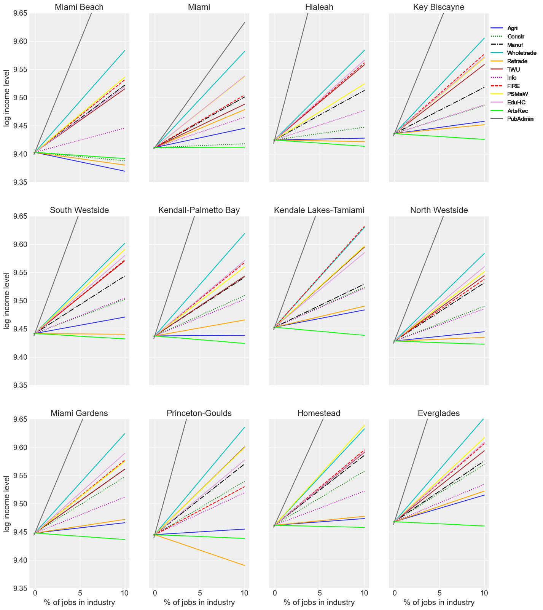

Interestingly, after training our model and looking at the results by
subdivision, it appears that the industry that could have the biggest
effect on increasing median income, across all subdivisions, is public
administration, followed closely by the wholesale trade industry. In the
majority of subdivisions, the arts, entertainment, recreation, and
accommodation and food services industry seems to have the lowest effect
on increasing median income, and in fact, it actually appears that the
higher the percentage of people employed in that industry are, the lower
the median income level would be in each subdivision. This is not too
surprising, as a quick Google search of "lowest paying jobs" will be
topped by a host of occupations in the restaurant and food services
industry. In most subdivisions, the retail trade and agriculture,
forestry, fishing and hunting, and mining industries appear to have flat
to minorly positive effects on increasing median income, however, when
we look at the subdivisions of Miami Beach and Princeton-Goulds, a
different story emerges. An increase in retail trade jobs in
Princeton-Goulds has a negative effect on median income, while an
increase in both retail trade and agriculture, forestry, fishing and
hunting, and mining jobs in Miami Beach would have a negative effect on
median income.These results do not necessarily mean that public
administration and wholesale trade jobs pay the most, but could be
indicative that they are industries experiencing labor shortages that,
on average, pay more relative to some of the other industries, such as
the arts, entertainment, recreation, and accommodation and food services
industry, and perhaps incentivizing individuals to change industries
could lead to an increase in median income in the area. A quick search
of the datausa.io database does indicate that the average salary of
public administration employees is \$66,232, compared to only \$26,814
of those in arts, entertainment, recreation, and accommodation and food
services.


The above chart makes it apparent that increasing the education level of
residents in certain subdivisions means more, in terms of increasing
median income, than it does in other subdivisions. For instance, in the
subdivision for the city of Miami, increasing the percentage of
residents who have a bachelor's degree or higher would have far less of
an effect on increasing median income in the area than it would in more
rural areas, such as the subdivisions of the Everglades and
Princeton-Goulds. This is most likely due to the fact that these areas
already have a lower average percentage of bachelor's degree attainment
among their residents, than the more urban areas do, so increasing
educational attainment in already underserved areas would certainly mean
more than it would in areas where more residents already have a
bachelor's degree.

#### <ins>Business Growth Rate Model Findings:</ins>

  ----------------------------------- -----------------------------------
<p align="center">
   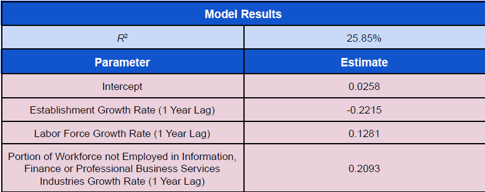
</p>

  ----------------------------------- -----------------------------------

As seen in our literature review, forecasting business growth is no easy
task. Even with access to tens of thousands of more data points via
Yelp's open source database, the Harvard Business Study was only able to
achieve a 26.4 percent $R^2$ on its testing sample. Using a fractional
amount of data from only the American Community Survey (539 observations
total), our model was able to achieve comparable results to that of the
Harvard Business Study, as it attained a $R^2$ of 25.85 percent. As can
be seen in the above table, assuming a zip code in Miami-Dade County
were to experience zero growth in number of business establishments,
labor force and portion of the workforce not employed in the
information, finance or professional business services industries from
the prior year, the predicted business establishment growth rate for the
following year would still be 2.58 percent. Interestingly, growth in the
number of businesses from the previous year is negatively associated
with business growth for the following year. We theorize that this is
most likely due to the availability of commercial real estate, as if
more businesses open up in a particular zip code one year, then there
will be lease available commercial real estate for businesses to access
the following year (assuming there is not significant real estate
development in new commercial real estate properties).

Conversely, the remaining two predictors, labor force growth rate and
portion of the workforce not employed in the information, finance or
professional business services industries growth rate, have a positive
effect on the business establishment growth rate. As the research of our
predecessors at the University of Chicago pointed out, the industries of
Professional and Business Services, Information, and Financial
Activities are fairly resilient to economic shocks, especially in terms
of unemployment. For instance, in the wake of the Great Recession, from
June 2009 to August 2017, Information jobs saw a 3% decline in
employment numbers but the greatest increase in average weekly earnings
at 30% (Green, 2017). It stands to reason that the sensitivity of
employment in other industries to economic conditions, relative to those
of information, finance and professional business services, is therefore
a fairly reliable predictor of future business establishment growth
rates. As our model indicates, holding all else constant, a one percent
increase in the portion of the workforce not employed in the
information, finance or professional business services industries growth
rate is associated with a 20.93 percent increase in business
establishment growth the following year.

Since the U.S. Census Bureau did not release its standard estimates from
the 2020 American Community Survey due to the impacts of the COVID-19
pandemic on data collection, we decided to use our model to predict them
instead, as we believe it could still be a helpful tool for Miami
leaders in their future decision making. To enhance the interpretability
of our model for the end user, our results were overlaid on an
interactive map using the folium library, so users can see the
geographic effects of our model.

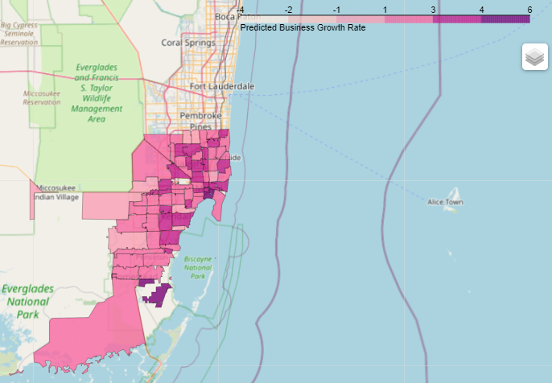

As can be seen in the above chart, our model indicates that potential
business growth is more abundant in zip codes closer to the coast and
those closer to city centers, such as downtown Miami, Hialeah and
Kendall. There also appears to be a decreasing trend in business growth
opportunities the further inland one moves, and some zip codes,
specifically ones far from city centers in more rural areas have
negative projected business growth rates.

#### <ins>Industry Employment Model Findings:</ins>

After training our model on monthly industry employment figures from
January of 2003 to October of 2020, we tested it on the most recent
twelve months (November 2020 to October 2021), which resulted in a root
mean square error of 0.0016168, indicating that the square root of the
average of squared differences between our predicted proportional
industry employment and the actual proportional industry employment was
less than 0.2%. If we were to use the mean absolute error (which does
not penalize larger errors) to evaluate our model, we could say with
absolute certainty that the average difference between our predicted
values and the actual ones would be less than or equal to 0.16168%, as
RMSE will always be larger or equal to MAE. To make the data more
interpretable for the end user, we converted our predicted monthly
industry proportions back to actual employment numbers by multiplying
them by their respective total nonfarm monthly employment figures. These
predictions against their actual values can be seen below:

<p align="center">
   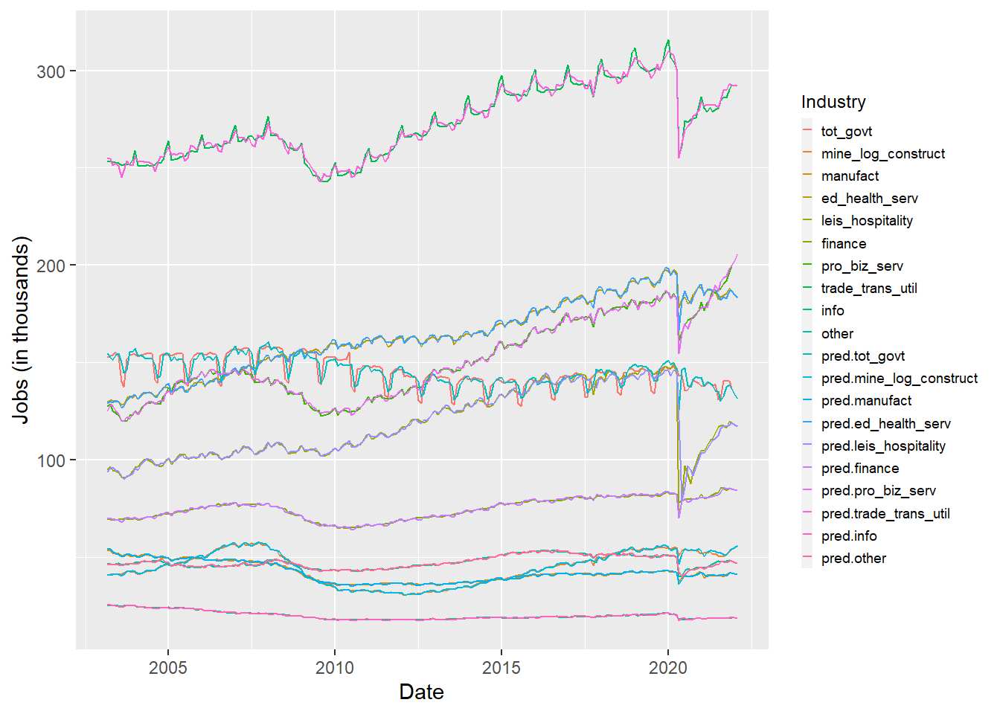
</p>

As can be seen in the above graph, our predicted employment numbers do a
fairly decent job in approximating the actual monthly employment numbers
for each industry. To be able to apply our model in forecasting industry
employment figures, specifically the next three months, we first needed
to forecast the next three months of total nonfarm employment. To do
this, we utilized an autoregressive integrated moving average (ARIMA)
model, trained on total nonfarm monthly employment figures from January
of 2003 to October of this year (2021). For the purpose of consistency
within the Decision Support Tool, our ARIMA model utilized the same
seasonality parameters that our predecessors at the University of
Chicago used for building their unemployment rate forecasting model. We
then forecasted the next 3 months of total nonfarm employment using this
model. Our Dirichlet model was then utilized with the most recent
monthly industry employment numbers from October to predict the
proportional industry employment for November, which was then used to
predict those for December, and those estimates were finally used to
predict the proportional industry employment for January of next year.
These predicted proportions were then multiplied by their respective
predicted monthly total nonfarm estimates to get individual industry job
estimates for the next three months, which can be seen in the table
below[^1].

<table style="width: 4.7e+2pt;border-collapse:collapse;border:none;" align="center">
    <tbody>
        <tr>
            <td style="width: 165.75pt;border: 1pt solid black;background: rgb(17, 85, 204);padding: 5pt;vertical-align: top;">
                <p style='margin:0in;margin-bottom:.0001pt;line-height:normal;font-size:15px;font-family:"Arial",sans-serif;border:none;'><strong><span style="color:white;">Industry</span></strong></p>
            </td>
            <td style="width: 102.2pt;border-top: 1pt solid black;border-right: 1pt solid black;border-bottom: 1pt solid black;border-image: initial;border-left: none;background: rgb(17, 85, 204);padding: 5pt;vertical-align: top;">
                <p style='margin:0in;margin-bottom:.0001pt;line-height:normal;font-size:15px;font-family:"Arial",sans-serif;text-align:center;border:none;'><strong><span style="color:white;">Nov-2021</span></strong></p>
            </td>
            <td style="width: 102.2pt;border-top: 1pt solid black;border-right: 1pt solid black;border-bottom: 1pt solid black;border-image: initial;border-left: none;background: rgb(17, 85, 204);padding: 5pt;vertical-align: top;">
                <p style='margin:0in;margin-bottom:.0001pt;line-height:normal;font-size:15px;font-family:"Arial",sans-serif;text-align:center;border:none;'><strong><span style="color:white;">Dec-2021</span></strong></p>
            </td>
            <td style="width: 102.2pt;border-top: 1pt solid black;border-right: 1pt solid black;border-bottom: 1pt solid black;border-image: initial;border-left: none;background: rgb(17, 85, 204);padding: 5pt;vertical-align: top;">
                <p style='margin:0in;margin-bottom:.0001pt;line-height:normal;font-size:15px;font-family:"Arial",sans-serif;text-align:center;border:none;'><strong><span style="color:white;">Jan-2022</span></strong></p>
            </td>
        </tr>
        <tr>
            <td style="width: 165.75pt;border-right: 1pt solid black;border-bottom: 1pt solid black;border-left: 1pt solid black;border-image: initial;border-top: none;background: rgb(217, 217, 217);padding: 5pt;vertical-align: top;">
                <p style='margin:0in;margin-bottom:.0001pt;line-height:normal;font-size:15px;font-family:"Arial",sans-serif;border:none;'><strong>Total Nonfarm</strong></p>
            </td>
            <td style="width: 102.2pt;border-top: none;border-left: none;border-bottom: 1pt solid black;border-right: 1pt solid black;background: rgb(217, 217, 217);padding: 5pt;vertical-align: top;">
                <p style='margin:0in;margin-bottom:.0001pt;line-height:normal;font-size:15px;font-family:"Arial",sans-serif;text-align:center;border:none;'><strong>1,181.6</strong></p>
            </td>
            <td style="width: 102.2pt;border-top: none;border-left: none;border-bottom: 1pt solid black;border-right: 1pt solid black;background: rgb(217, 217, 217);padding: 5pt;vertical-align: top;">
                <p style='margin:0in;margin-bottom:.0001pt;line-height:normal;font-size:15px;font-family:"Arial",sans-serif;text-align:center;border:none;'><strong>1,177.2</strong></p>
            </td>
            <td style="width: 102.2pt;border-top: none;border-left: none;border-bottom: 1pt solid black;border-right: 1pt solid black;background: rgb(217, 217, 217);padding: 5pt;vertical-align: top;">
                <p style='margin:0in;margin-bottom:.0001pt;line-height:normal;font-size:15px;font-family:"Arial",sans-serif;text-align:center;border:none;'><strong>1,177.1</strong></p>
            </td>
        </tr>
        <tr>
            <td style="width: 165.75pt;border-right: 1pt solid black;border-bottom: 1pt solid black;border-left: 1pt solid black;border-image: initial;border-top: none;background: rgb(243, 243, 243);padding: 5pt;vertical-align: top;">
                <p style='margin:0in;margin-bottom:.0001pt;line-height:normal;font-size:15px;font-family:"Arial",sans-serif;border:none;'>Total Government Jobs</p>
            </td>
            <td style="width:102.2pt;border-top:none;border-left:none;border-bottom:solid black 1.0pt;border-right:solid black 1.0pt;background:#F3F3F3;padding:5.0pt 5.0pt 5.0pt 5.0pt;">
                <p style='margin:0in;margin-bottom:.0001pt;line-height:normal;font-size:15px;font-family:"Arial",sans-serif;text-align:center;border:none;'>136.7</p>
            </td>
            <td style="width:102.2pt;border-top:none;border-left:none;border-bottom:solid black 1.0pt;border-right:solid black 1.0pt;background:#F3F3F3;padding:5.0pt 5.0pt 5.0pt 5.0pt;">
                <p style='margin:0in;margin-bottom:.0001pt;line-height:normal;font-size:15px;font-family:"Arial",sans-serif;text-align:center;border:none;'>133.6</p>
            </td>
            <td style="width:102.2pt;border-top:none;border-left:none;border-bottom:solid black 1.0pt;border-right:solid black 1.0pt;background:#F3F3F3;padding:5.0pt 5.0pt 5.0pt 5.0pt;">
                <p style='margin:0in;margin-bottom:.0001pt;line-height:normal;font-size:15px;font-family:"Arial",sans-serif;text-align:center;border:none;'>131.4</p>
            </td>
        </tr>
        <tr>
            <td style="width: 165.75pt;border-right: 1pt solid black;border-bottom: 1pt solid black;border-left: 1pt solid black;border-image: initial;border-top: none;background: rgb(243, 243, 243);padding: 5pt;vertical-align: top;">
                <p style='margin:0in;margin-bottom:.0001pt;line-height:normal;font-size:15px;font-family:"Arial",sans-serif;border:none;'>Mining, Logging &amp; Construction</p>
            </td>
            <td style="width:102.2pt;border-top:none;border-left:none;border-bottom:solid black 1.0pt;border-right:solid black 1.0pt;background:#F3F3F3;padding:5.0pt 5.0pt 5.0pt 5.0pt;">
                <p style='margin:0in;margin-bottom:.0001pt;line-height:normal;font-size:15px;font-family:"Arial",sans-serif;text-align:center;border:none;'>53.9</p>
            </td>
            <td style="width:102.2pt;border-top:none;border-left:none;border-bottom:solid black 1.0pt;border-right:solid black 1.0pt;background:#F3F3F3;padding:5.0pt 5.0pt 5.0pt 5.0pt;">
                <p style='margin:0in;margin-bottom:.0001pt;line-height:normal;font-size:15px;font-family:"Arial",sans-serif;text-align:center;border:none;'>54.8</p>
            </td>
            <td style="width:102.2pt;border-top:none;border-left:none;border-bottom:solid black 1.0pt;border-right:solid black 1.0pt;background:#F3F3F3;padding:5.0pt 5.0pt 5.0pt 5.0pt;">
                <p style='margin:0in;margin-bottom:.0001pt;line-height:normal;font-size:15px;font-family:"Arial",sans-serif;text-align:center;border:none;'>56.1</p>
            </td>
        </tr>
        <tr>
            <td style="width: 165.75pt;border-right: 1pt solid black;border-bottom: 1pt solid black;border-left: 1pt solid black;border-image: initial;border-top: none;background: rgb(243, 243, 243);padding: 5pt;vertical-align: top;">
                <p style='margin:0in;margin-bottom:.0001pt;line-height:normal;font-size:15px;font-family:"Arial",sans-serif;border:none;'>Manufacturing</p>
            </td>
            <td style="width:102.2pt;border-top:none;border-left:none;border-bottom:solid black 1.0pt;border-right:solid black 1.0pt;background:#F3F3F3;padding:5.0pt 5.0pt 5.0pt 5.0pt;">
                <p style='margin:0in;margin-bottom:.0001pt;line-height:normal;font-size:15px;font-family:"Arial",sans-serif;text-align:center;border:none;'>41.7</p>
            </td>
            <td style="width:102.2pt;border-top:none;border-left:none;border-bottom:solid black 1.0pt;border-right:solid black 1.0pt;background:#F3F3F3;padding:5.0pt 5.0pt 5.0pt 5.0pt;">
                <p style='margin:0in;margin-bottom:.0001pt;line-height:normal;font-size:15px;font-family:"Arial",sans-serif;text-align:center;border:none;'>41.4</p>
            </td>
            <td style="width:102.2pt;border-top:none;border-left:none;border-bottom:solid black 1.0pt;border-right:solid black 1.0pt;background:#F3F3F3;padding:5.0pt 5.0pt 5.0pt 5.0pt;">
                <p style='margin:0in;margin-bottom:.0001pt;line-height:normal;font-size:15px;font-family:"Arial",sans-serif;text-align:center;border:none;'>41.2</p>
            </td>
        </tr>
        <tr>
            <td style="width: 165.75pt;border-right: 1pt solid black;border-bottom: 1pt solid black;border-left: 1pt solid black;border-image: initial;border-top: none;background: rgb(243, 243, 243);padding: 5pt;vertical-align: top;">
                <p style='margin:0in;margin-bottom:.0001pt;line-height:normal;font-size:15px;font-family:"Arial",sans-serif;border:none;'>Education &amp; Health Services</p>
            </td>
            <td style="width:102.2pt;border-top:none;border-left:none;border-bottom:solid black 1.0pt;border-right:solid black 1.0pt;background:#F3F3F3;padding:5.0pt 5.0pt 5.0pt 5.0pt;">
                <p style='margin:0in;margin-bottom:.0001pt;line-height:normal;font-size:15px;font-family:"Arial",sans-serif;text-align:center;border:none;'>186.8</p>
            </td>
            <td style="width:102.2pt;border-top:none;border-left:none;border-bottom:solid black 1.0pt;border-right:solid black 1.0pt;background:#F3F3F3;padding:5.0pt 5.0pt 5.0pt 5.0pt;">
                <p style='margin:0in;margin-bottom:.0001pt;line-height:normal;font-size:15px;font-family:"Arial",sans-serif;text-align:center;border:none;'>184.7</p>
            </td>
            <td style="width:102.2pt;border-top:none;border-left:none;border-bottom:solid black 1.0pt;border-right:solid black 1.0pt;background:#F3F3F3;padding:5.0pt 5.0pt 5.0pt 5.0pt;">
                <p style='margin:0in;margin-bottom:.0001pt;line-height:normal;font-size:15px;font-family:"Arial",sans-serif;text-align:center;border:none;'>183.3</p>
            </td>
        </tr>
        <tr>
            <td style="width: 165.75pt;border-right: 1pt solid black;border-bottom: 1pt solid black;border-left: 1pt solid black;border-image: initial;border-top: none;background: rgb(243, 243, 243);padding: 5pt;vertical-align: top;">
                <p style='margin:0in;margin-bottom:.0001pt;line-height:normal;font-size:15px;font-family:"Arial",sans-serif;border:none;'>Leisure &amp; Hospitality</p>
            </td>
            <td style="width:102.2pt;border-top:none;border-left:none;border-bottom:solid black 1.0pt;border-right:solid black 1.0pt;background:#F3F3F3;padding:5.0pt 5.0pt 5.0pt 5.0pt;">
                <p style='margin:0in;margin-bottom:.0001pt;line-height:normal;font-size:15px;font-family:"Arial",sans-serif;text-align:center;border:none;'>119.1</p>
            </td>
            <td style="width:102.2pt;border-top:none;border-left:none;border-bottom:solid black 1.0pt;border-right:solid black 1.0pt;background:#F3F3F3;padding:5.0pt 5.0pt 5.0pt 5.0pt;">
                <p style='margin:0in;margin-bottom:.0001pt;line-height:normal;font-size:15px;font-family:"Arial",sans-serif;text-align:center;border:none;'>117.9</p>
            </td>
            <td style="width:102.2pt;border-top:none;border-left:none;border-bottom:solid black 1.0pt;border-right:solid black 1.0pt;background:#F3F3F3;padding:5.0pt 5.0pt 5.0pt 5.0pt;">
                <p style='margin:0in;margin-bottom:.0001pt;line-height:normal;font-size:15px;font-family:"Arial",sans-serif;text-align:center;border:none;'>117.2</p>
            </td>
        </tr>
        <tr>
            <td style="width: 165.75pt;border-right: 1pt solid black;border-bottom: 1pt solid black;border-left: 1pt solid black;border-image: initial;border-top: none;background: rgb(243, 243, 243);padding: 5pt;vertical-align: top;">
                <p style='margin:0in;margin-bottom:.0001pt;line-height:normal;font-size:15px;font-family:"Arial",sans-serif;border:none;'>Finance</p>
            </td>
            <td style="width:102.2pt;border-top:none;border-left:none;border-bottom:solid black 1.0pt;border-right:solid black 1.0pt;background:#F3F3F3;padding:5.0pt 5.0pt 5.0pt 5.0pt;">
                <p style='margin:0in;margin-bottom:.0001pt;line-height:normal;font-size:15px;font-family:"Arial",sans-serif;text-align:center;border:none;'>85.1</p>
            </td>
            <td style="width:102.2pt;border-top:none;border-left:none;border-bottom:solid black 1.0pt;border-right:solid black 1.0pt;background:#F3F3F3;padding:5.0pt 5.0pt 5.0pt 5.0pt;">
                <p style='margin:0in;margin-bottom:.0001pt;line-height:normal;font-size:15px;font-family:"Arial",sans-serif;text-align:center;border:none;'>84.5</p>
            </td>
            <td style="width:102.2pt;border-top:none;border-left:none;border-bottom:solid black 1.0pt;border-right:solid black 1.0pt;background:#F3F3F3;padding:5.0pt 5.0pt 5.0pt 5.0pt;">
                <p style='margin:0in;margin-bottom:.0001pt;line-height:normal;font-size:15px;font-family:"Arial",sans-serif;text-align:center;border:none;'>84.3</p>
            </td>
        </tr>
        <tr>
            <td style="width: 165.75pt;border-right: 1pt solid black;border-bottom: 1pt solid black;border-left: 1pt solid black;border-image: initial;border-top: none;background: rgb(243, 243, 243);padding: 5pt;vertical-align: top;">
                <p style='margin:0in;margin-bottom:.0001pt;line-height:normal;font-size:15px;font-family:"Arial",sans-serif;border:none;'>Professional Business Services</p>
            </td>
            <td style="width:102.2pt;border-top:none;border-left:none;border-bottom:solid black 1.0pt;border-right:solid black 1.0pt;background:#F3F3F3;padding:5.0pt 5.0pt 5.0pt 5.0pt;">
                <p style='margin:0in;margin-bottom:.0001pt;line-height:normal;font-size:15px;font-family:"Arial",sans-serif;text-align:center;border:none;'>199.7</p>
            </td>
            <td style="width:102.2pt;border-top:none;border-left:none;border-bottom:solid black 1.0pt;border-right:solid black 1.0pt;background:#F3F3F3;padding:5.0pt 5.0pt 5.0pt 5.0pt;">
                <p style='margin:0in;margin-bottom:.0001pt;line-height:normal;font-size:15px;font-family:"Arial",sans-serif;text-align:center;border:none;'>202.2</p>
            </td>
            <td style="width:102.2pt;border-top:none;border-left:none;border-bottom:solid black 1.0pt;border-right:solid black 1.0pt;background:#F3F3F3;padding:5.0pt 5.0pt 5.0pt 5.0pt;">
                <p style='margin:0in;margin-bottom:.0001pt;line-height:normal;font-size:15px;font-family:"Arial",sans-serif;text-align:center;border:none;'>205.7</p>
            </td>
        </tr>
        <tr>
            <td style="width: 165.75pt;border-right: 1pt solid black;border-bottom: 1pt solid black;border-left: 1pt solid black;border-image: initial;border-top: none;background: rgb(243, 243, 243);padding: 5pt;vertical-align: top;">
                <p style='margin:0in;margin-bottom:.0001pt;line-height:normal;font-size:15px;font-family:"Arial",sans-serif;border:none;'>Trade, Transportation &amp; Utilities</p>
            </td>
            <td style="width:102.2pt;border-top:none;border-left:none;border-bottom:solid black 1.0pt;border-right:solid black 1.0pt;background:#F3F3F3;padding:5.0pt 5.0pt 5.0pt 5.0pt;">
                <p style='margin:0in;margin-bottom:.0001pt;line-height:normal;font-size:15px;font-family:"Arial",sans-serif;text-align:center;border:none;'>292.4</p>
            </td>
            <td style="width:102.2pt;border-top:none;border-left:none;border-bottom:solid black 1.0pt;border-right:solid black 1.0pt;background:#F3F3F3;padding:5.0pt 5.0pt 5.0pt 5.0pt;">
                <p style='margin:0in;margin-bottom:.0001pt;line-height:normal;font-size:15px;font-family:"Arial",sans-serif;text-align:center;border:none;'>292.2</p>
            </td>
            <td style="width:102.2pt;border-top:none;border-left:none;border-bottom:solid black 1.0pt;border-right:solid black 1.0pt;background:#F3F3F3;padding:5.0pt 5.0pt 5.0pt 5.0pt;">
                <p style='margin:0in;margin-bottom:.0001pt;line-height:normal;font-size:15px;font-family:"Arial",sans-serif;text-align:center;border:none;'>292.2</p>
            </td>
        </tr>
        <tr>
            <td style="width: 165.75pt;border-right: 1pt solid black;border-bottom: 1pt solid black;border-left: 1pt solid black;border-image: initial;border-top: none;background: rgb(243, 243, 243);padding: 5pt;vertical-align: top;">
                <p style='margin:0in;margin-bottom:.0001pt;line-height:normal;font-size:15px;font-family:"Arial",sans-serif;border:none;'>Information</p>
            </td>
            <td style="width:102.2pt;border-top:none;border-left:none;border-bottom:solid black 1.0pt;border-right:solid black 1.0pt;background:#F3F3F3;padding:5.0pt 5.0pt 5.0pt 5.0pt;">
                <p style='margin:0in;margin-bottom:.0001pt;line-height:normal;font-size:15px;font-family:"Arial",sans-serif;text-align:center;border:none;'>18.7</p>
            </td>
            <td style="width:102.2pt;border-top:none;border-left:none;border-bottom:solid black 1.0pt;border-right:solid black 1.0pt;background:#F3F3F3;padding:5.0pt 5.0pt 5.0pt 5.0pt;">
                <p style='margin:0in;margin-bottom:.0001pt;line-height:normal;font-size:15px;font-family:"Arial",sans-serif;text-align:center;border:none;'>18.7</p>
            </td>
            <td style="width:102.2pt;border-top:none;border-left:none;border-bottom:solid black 1.0pt;border-right:solid black 1.0pt;background:#F3F3F3;padding:5.0pt 5.0pt 5.0pt 5.0pt;">
                <p style='margin:0in;margin-bottom:.0001pt;line-height:normal;font-size:15px;font-family:"Arial",sans-serif;text-align:center;border:none;'>18.6</p>
            </td>
        </tr>
        <tr>
            <td style="width: 165.75pt;border-right: 1pt solid black;border-bottom: 1pt solid black;border-left: 1pt solid black;border-image: initial;border-top: none;background: rgb(243, 243, 243);padding: 5pt;vertical-align: top;">
                <p style='margin:0in;margin-bottom:.0001pt;line-height:normal;font-size:15px;font-family:"Arial",sans-serif;border:none;'>Other</p>
            </td>
            <td style="width:102.2pt;border-top:none;border-left:none;border-bottom:solid black 1.0pt;border-right:solid black 1.0pt;background:#F3F3F3;padding:5.0pt 5.0pt 5.0pt 5.0pt;">
                <p style='margin:0in;margin-bottom:.0001pt;line-height:normal;font-size:15px;font-family:"Arial",sans-serif;text-align:center;border:none;'>47.8</p>
            </td>
            <td style="width:102.2pt;border-top:none;border-left:none;border-bottom:solid black 1.0pt;border-right:solid black 1.0pt;background:#F3F3F3;padding:5.0pt 5.0pt 5.0pt 5.0pt;">
                <p style='margin:0in;margin-bottom:.0001pt;line-height:normal;font-size:15px;font-family:"Arial",sans-serif;text-align:center;border:none;'>47.2</p>
            </td>
            <td style="width:102.2pt;border-top:none;border-left:none;border-bottom:solid black 1.0pt;border-right:solid black 1.0pt;background:#F3F3F3;padding:5.0pt 5.0pt 5.0pt 5.0pt;">
                <p style='margin:0in;margin-bottom:.0001pt;line-height:normal;font-size:15px;font-family:"Arial",sans-serif;text-align:center;border:none;'>46.9</p>
            </td>
        </tr>
    </tbody>
</table>

## Conclusion and Future Work 

To address our research questions, a bayesian hierarchical model,
PanelOLS regression, and a Dirichlet regression were implemented. Our
Bayesian Hierarchical model suggested that a shift in the distribution
of resident employment from certain lower paying industries, such as
that of arts, entertainment, recreation, and accommodation and food
services, to those with a higher relative average pay (that are perhaps
underserved), such as public administration and wholesale trade, would
lead to an increase in the median income level for each area, albeit the
magnitude of these effects vary by subdivision. Similarly, our model
shows that increasing the educational attainment of residents,
represented as the percentage with a bachelor's degree or higher, would
also lead to an increase in median income across all subdivisions. Our
business growth rate model which was built using the PanelOLS regression
obtained a $R^2$ of 25.85%, approximately on par with the baseline model
from the Harvard Business Study which attained a $R^2$ of 26.4%. The
results of our Dirichelet regression model obtained a RMSE of
approximately 0.0016168 indicating our predicted employment numbers did
a fairly decent job in approximating the actual monthly employment
numbers for each industry. With this model performing exceptionally
well, it will provide the leaders of Miami a deeper look into the future
composition of their labor market. It will help them know where and how
to allocate their resources in the event a crisis like this were to
occur again. US Ignite\'s Decision Support Tool is an ongoing
development utilizing work from multiple student groups whom we hope can
further build upon the insights garnered from our models. We believe it
will go a long way in providing a comprehensive composition of the Miami
economy, offering ways to solve a crisis for the betterment of their
citizens.

Expansion and further development of this project could include
acquiring additional data. This could be done through partnership with
data creators and local businesses who are able to provide data that
would help create more informed decisions and gain valuable insights in
other areas of interest. One example would be evaluating the effect the
pandemic had on businesses that did not have an online presence versus
those that did. Furthermore, partnerships with data creators could be
further evaluated by assessing the quality and integrity of the data in
relation to addressing the problem at stake. Future teams can implement
this and even further go on to evaluate how businesses that have a
delivery option fared against those that did not. Impact on individuals,
various communities, households, and even healthcare are further areas
that could be explored in this study. This would help further develop
the Decision Support Tool in expanding their solutions for the
Miami-Dade county and be able to narrow down actions government
officials need to take to curate a solution and meet the needs of the
citizens.

## References

Brugger, Bernhard. "A Guide to Panel Data Regression: Theoretics and
Implementation with Python." Medium, Towards Data Science, 14 Feb. 2021,
https://towardsdatascience.com/a-guide-to-panel-data-regression-theoretics-and-implementation-with-python-4c84c5055cf8.

"COVID-Impact-Survey_October." Florida Chamber of Commerce, Miami
Chamber, Oct. 2021,
http://www.flchamber.com/wp-content/uploads/2020/10/COVID-Impact-Survey_October.pdf.

Glaeser, Edward, et al. "Nowcasting the Local Economy: Using Yelp Data
to Measure Economic Activity." 2017, https://doi.org/10.3386/w24010.

Granger, Clive W.j. "Spurious Regressions in Econometrics." A Companion
to Theoretical Econometrics, pp. 557--561.,
https://doi.org/10.1002/9780470996249.ch27.

Green, K. (2017). Economy in recovery: How selected industries have
fared since the Great

Recession : Career Outlook. U.S. Bureau of Labor Statistics.

https://www.bls.gov/careeroutlook/2017/data-on-display/wage-gains-byindustry.

Htm?view_full.

"COVID-Impact-Survey_Miami-Dade_Results-Report_Final." MiamiWay, Sept.
2021,
https://unitedwaymiami.org/wp-content/uploads/2021/10/COVID-Impact-Survey_Miami-Dade_Results-Report_Final.pdf.

Prabhakaran, Selva. "Dirichlet-Regression-With-R." Dirichlet Regression,
http://r-statistics.co/Dirichlet-Regression-With-R.html.

## Appendix

#### <ins>Industry Employment Model:</ins> Individual Industry Graphs

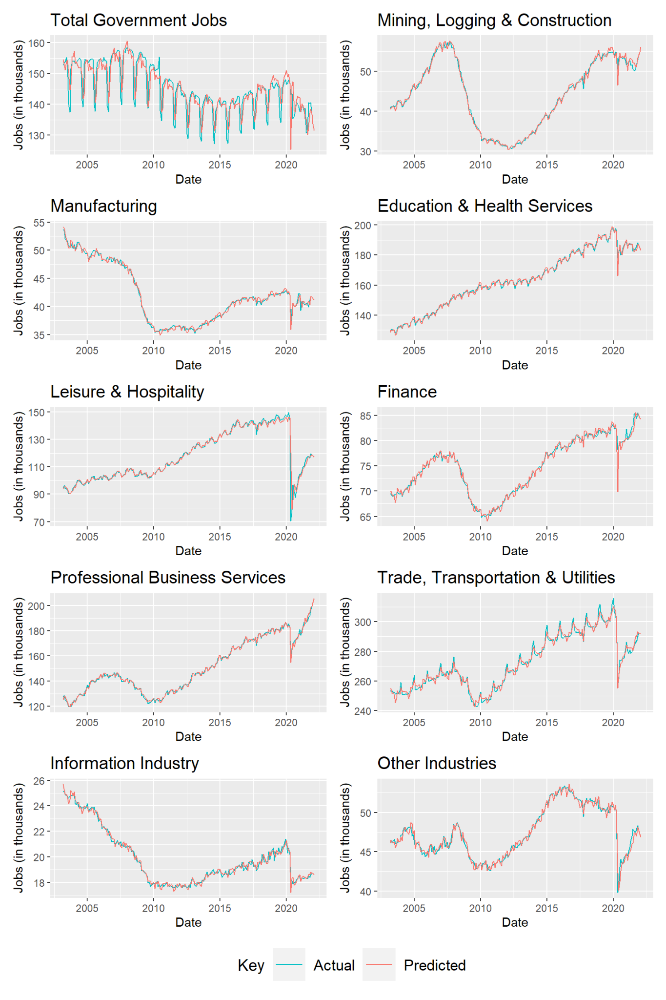

[^1]: Number of jobs, in thousands
